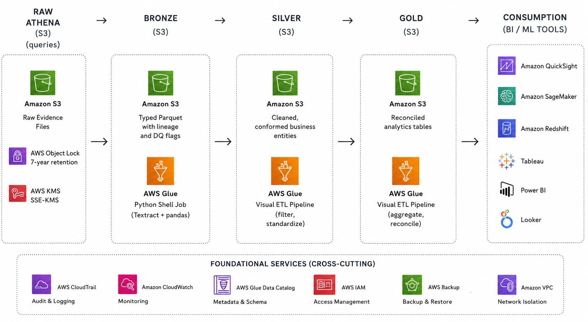

# IFTA Evidence Data Engineering Pipeline

An AWS-based data engineering solution for ingesting, normalizing, and reconciling
fuel tax evidence under the International Fuel Tax Agreement (IFTA).

The pipeline transforms heterogeneous evidence (Excel trip logs, scanned PDFs,
fuel receipts) into audit-ready analytics tables, with full lineage and
explicit data quality flags on every record.

---

## Architecture

A four-zone medallion architecture on AWS:



| Zone | Purpose | Recovery |
|---|---|---|
| **Raw** | Immutable legal record of submitted evidence | Bytes are version-protected |
| **Bronze** | Typed extraction output with lineage and confidence | Re-run extraction (~5 min) |
| **Silver** | Cleaned, conformed business entities | Re-run cleaning from bronze (~2 min) |
| **Gold** | Reconciled analytics tables for IFTA filing | Re-run aggregation from silver (~2 min) |

See [`docs/architecture.md`](docs/architecture.md) for the full design rationale.

---

## What's in this repository

```
ifta-aws-pipeline/
├── glue_jobs/
│   └── glue_extract.py            # Bronze extraction (Glue Python Shell)
├── terraform/
│   ├── main.tf                    # S3, KMS, IAM, Glue catalog, Athena
│   ├── variables.tf
│   ├── outputs.tf
│   └── example.tfvars
├── docs/
│   ├── architecture.md            # Design rationale and decisions
│   ├── data-model.md              # Bronze / silver / gold schemas
│   └── data-quality-codes.md      # Sixteen DQ codes across three severities
├── screenshots/                   # Pipeline canvas and query results
├── sample_outputs/                # Example Athena query output (CSV)
└── README.md
```

---

## Components

### Extraction (Glue Python Shell)

[`glue_jobs/glue_extract.py`](glue_jobs/glue_extract.py) ingests evidence from the raw
S3 layer and writes typed Parquet to bronze, using:

- **AWS Textract `start_expense_analysis`** (async) for fuel receipt PDFs.
  Returns named fields (vendor, total, tax components, date) with
  per-field confidence scores. Supports multi-page documents.
- **AWS Textract `start_document_analysis` with TABLES** for scanned distance
  log PDFs. Reconstructs row and column structure from image-only input.
- **pandas `read_excel`** for Excel trip logs. Multi-format date parsing,
  fuzzy city matching with rapidfuzz, originals preserved alongside corrections.

All three extractors produce the same typed output schema with lineage columns
(`src_uri`, `src_sha256`, `src_page_or_row`, `extraction_method`,
`extraction_confidence`, `ingested_at`, `processed_at`) on every row.

### Transformation (Glue Studio Visual ETL)

A single Glue Visual job reads bronze, materializes silver, and produces gold:

- **Silver**: filter to valid rows, enrich with jurisdiction attributes,
  persist as `silver_juris_km` and `silver_fuel`.
- **Gold**: aggregate kilometers and fuel by IFTA period and jurisdiction,
  full outer join to reconcile, persist as `gold_ifta_reconciliation`.

The pipeline is built declaratively in the Glue Studio canvas, with each node
exposing its schema and the Glue Data Catalog updated on every run.

### Catalog and query (Glue Catalog + Athena)

All bronze, silver, and gold tables register in the Glue Data Catalog under the
`ifta_medallion` database. The gold reconciliation is the primary auditor query:

```sql
SELECT
  ifta_period, jurisdiction_code, jurisdiction_name,
  "sum(km)"      AS total_km,
  "sum(litres)"  AS total_litres,
  CASE
    WHEN "sum(km)" > 0 AND "sum(litres)" IS NULL
         THEN 'NO_FUEL_IN_JURISDICTION'
    WHEN "sum(litres)" > 0 AND "sum(km)" IS NULL
         THEN 'FUEL_BUT_NO_TRAVEL'
    ELSE 'OK'
  END AS audit_flag
FROM gold_ifta_reconciliation
ORDER BY ifta_period, jurisdiction_code;
```

---

## Data quality and lineage

Quality concerns are recorded as data, never silently corrected. The
[`docs/data-quality-codes.md`](docs/data-quality-codes.md) reference lists all
sixteen codes across three severities.

Every curated record carries seven lineage columns identifying the source file,
page or row reference, extraction method, and confidence. An auditor can trace
any value in the gold table back to the original byte on the original page
through a single SQL filter.

---

## Deployment

### Prerequisites

- AWS account with permissions to create S3, KMS, IAM, Glue, and Athena resources
- AWS CLI configured (`aws configure`)
- Terraform >= 1.5

### Steps

```bash
# 1. Deploy infrastructure
cd terraform
terraform init
terraform plan  -var-file=example.tfvars
terraform apply -var-file=example.tfvars

# Capture output values
export RAW_BUCKET=$(terraform output -raw raw_bucket)
export CURATED_BUCKET=$(terraform output -raw curated_bucket)
export GLUE_DB=$(terraform output -raw glue_database_name)

# 2. Upload the extraction script to S3
aws s3 cp ../glue_jobs/glue_extract.py s3://$CURATED_BUCKET/glue_scripts/glue_extract.py

# 3. Create the Glue Python Shell job (Console or CLI)
#    See docs/architecture.md for the parameters used.

# 4. Upload evidence files to the raw bucket
aws s3 cp <your-evidence>/ s3://$RAW_BUCKET/ --recursive

# 5. Run the extraction job
aws glue start-job-run --job-name ifta-raw-to-bronze

# 6. Trigger the bronze crawler to register the new tables
aws glue start-crawler --name ifta-dev-bronze-crawler

# 7. Run the visual ETL job (built once in the Glue Studio Console)
aws glue start-job-run --job-name ifta-bronze-to-gold-reconciliation

# 8. Query the result in Athena
aws athena start-query-execution \
  --query-string "SELECT * FROM gold_ifta_reconciliation LIMIT 10" \
  --work-group ifta-dev-wg \
  --query-execution-context Database=$GLUE_DB
```

### Teardown

```bash
cd terraform
terraform destroy -var-file=example.tfvars
```

S3 buckets must be empty before `terraform destroy` can complete. Empty them
via the Console or with `aws s3 rm s3://$BUCKET --recursive` before destroying.

---

## Region and residency

Deployed to **ca-central-1** for Canadian data residency. Both raw evidence
and curated derivatives remain within Canadian borders, simplifying audit
review and data residency obligations.

---

## License

This is an assessment / portfolio project. The evidence files used during
development are synthetic and not included in this repository.
